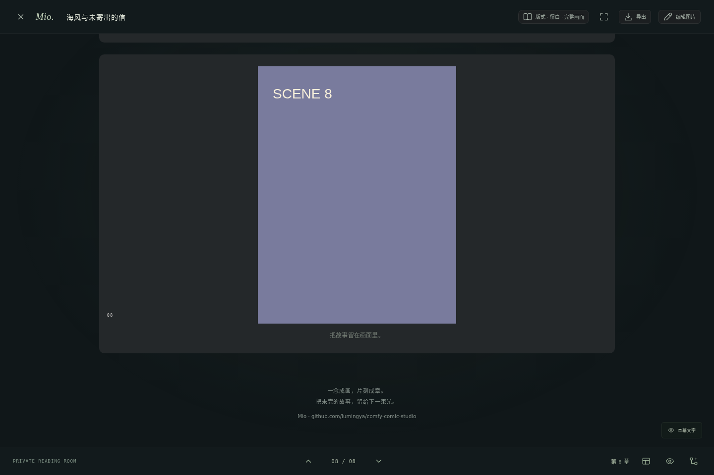
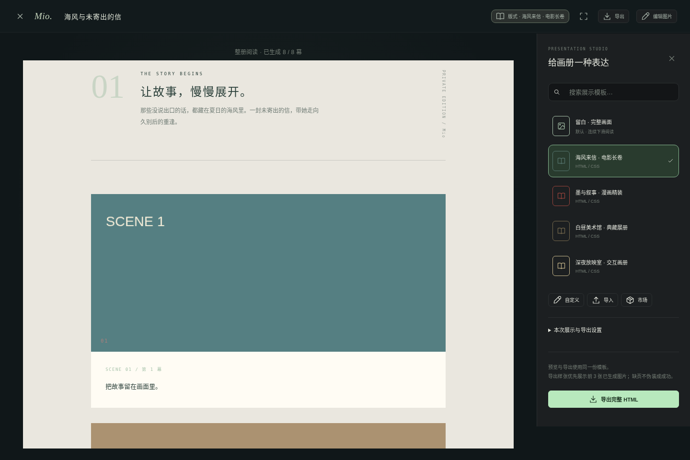
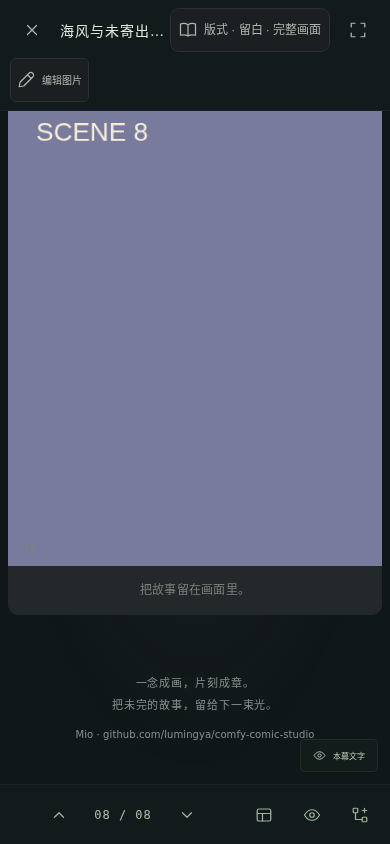

# 1.1.1 实际验收

2026-09-12。基线为实际交付的 1.1.0 ZIP，不是重新假设的上游版本。

- [旧包复现](baseline-repro.txt)：原默认 gallery；仅关闭模板面板就替换 iframe、改变版本并再次准备图片。
- [运行文件差异](baseline-diff.txt)。
- [完整回归](npm-test.txt)：退出 0。
- [新增预览专项](reader-preview.txt)：25 项通过。
- [构建](build.txt) 与 [冻结运行文件校验](tested-source.sha256)。
- [环境](environment.json)：Linux Chromium，桌面及模拟手机视口。
- [真实 ZIP 验收](package-smoke.txt)：旧数据迁移、连续阅读落款、模板面板不替换 iframe、图层保存、删除及用户文件保留。最终交付包还会再执行同一验收，最终日志另附在交付目录。

## 专项方法

使用真实本地 Python 服务及八幕横竖受控图片。记录 iframe 和 img 对象身份、src/srcdoc MutationObserver、编译次数、图片准备次数、载入控制器和模板脚本哨兵。检查载入期间及完成后反复展开/收起、搜索、重复选择不产生重建，而非仅比较外观或缓存命中。

五个内置模板分别编译并离线重开，核对落款文本、链接、唯一性；这些逐模板文件用于落款检查。另从 UI 实际下载一份完整画册，以 file:// 重开核对八幕正文和落款。翻页模板检查落款首屏隐藏、末页可见。

项目链接测试在 Chromium 默认弹窗阻止开启的情况下，通过用户点击打开固定地址，iframe 沙盒仍为 allow-scripts。用户自定义副本不加落款。

既有单幅阅读边界及性能测试保留，改为明确选择单幅模式后执行；没有删除它们来迎合新默认模式。原生成、图片编辑、删除和恢复回归也全部重新执行。

## 实际截图

## 边界

没有调用付费供应商，没有 Windows/macOS 原生或实体手机验收；Windows 专属 4 项明确跳过。没有将 Chromium 模拟视口称为手机真机。历史 1.0.1/1.1.0 验收目录保留，只代表各自版本的历史结果。
