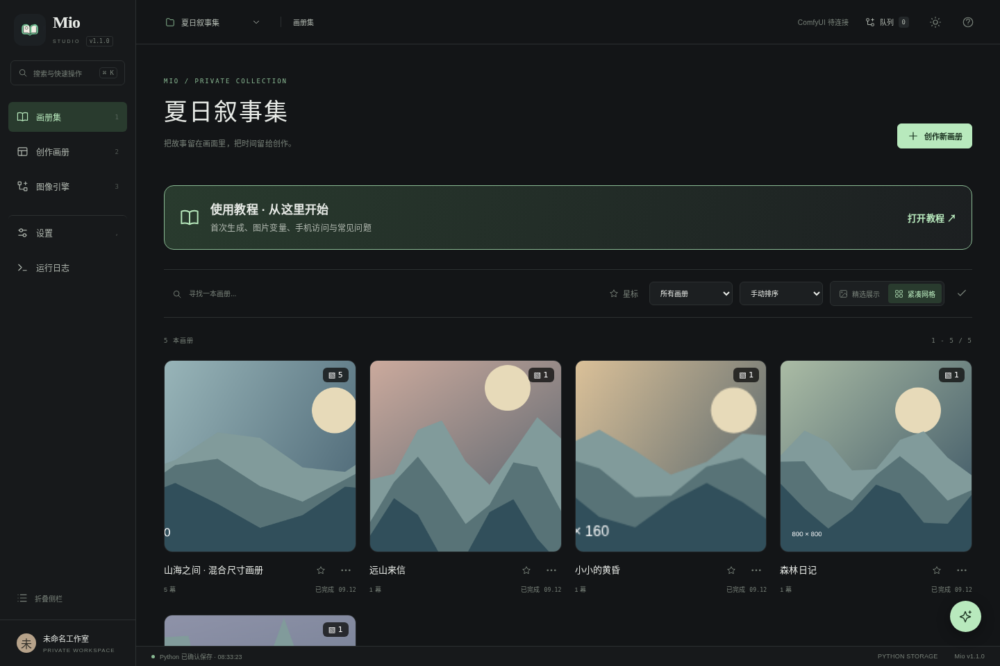
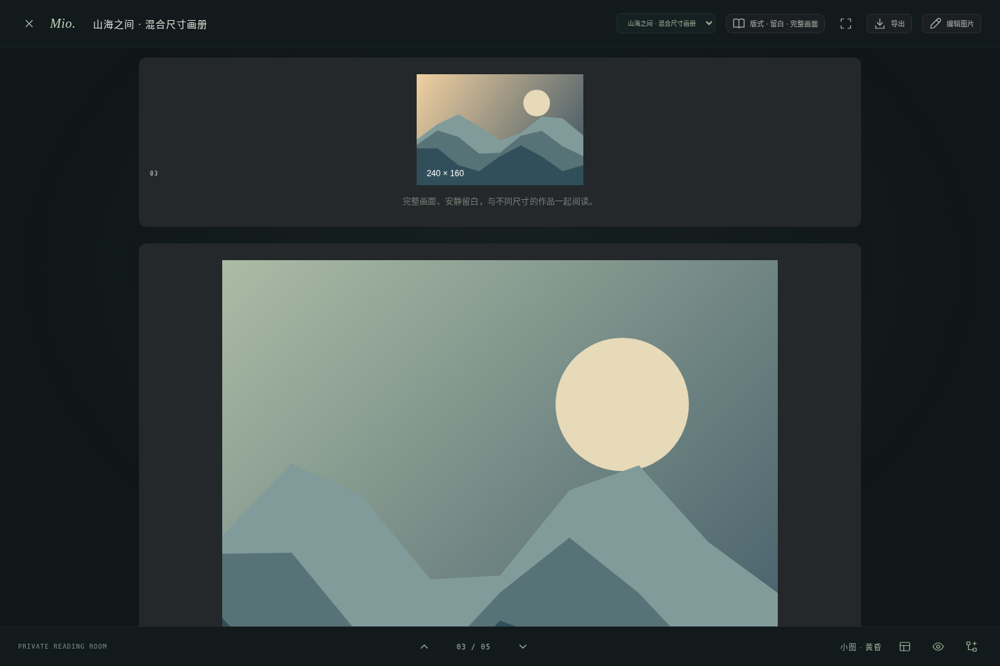
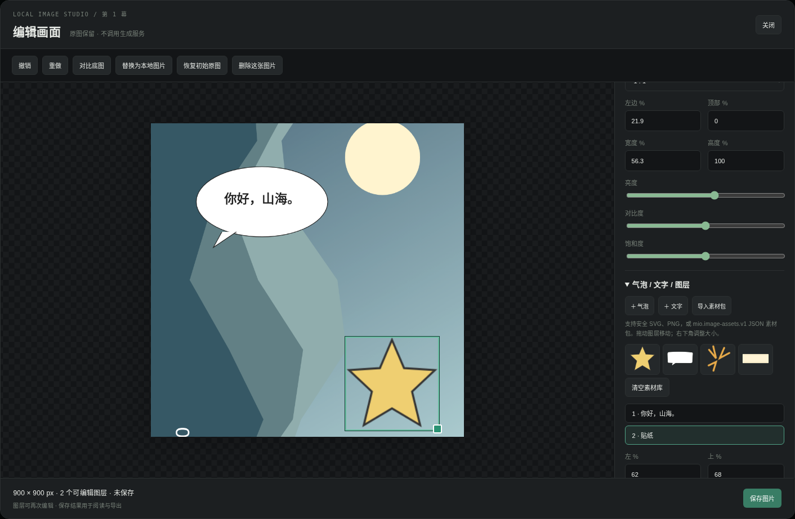
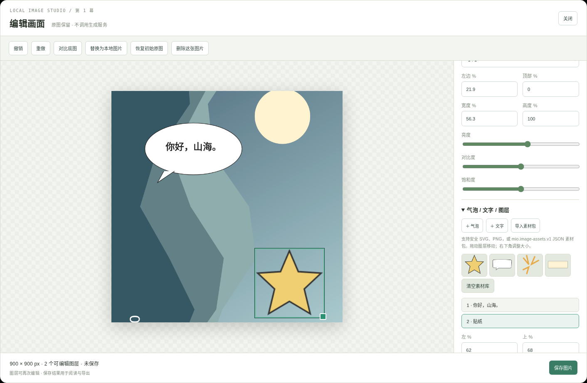
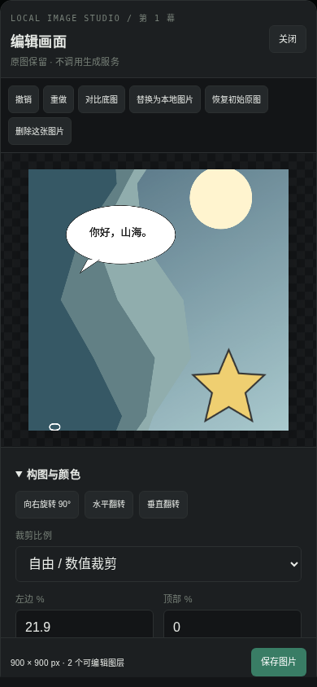
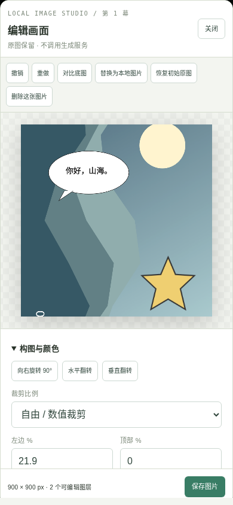

# 1.1.0 实际验收记录

日期：2026-09-12。所有素材为受控测试图，不是用户数据；没有使用付费密钥。

## 执行结果与源码

- [全量回归输出](npm-test.txt)：最终 `npm test` 退出 0。
- [本次图片编辑专项](pictures.txt)：30 项通过；全量回归后再次执行，补拍桌面浅色截图，运行源码未改变。
- [构建输出](build.txt)：独立 JS/CSS，语法通过。
- [运行源码 SHA-256](tested-source.sha256)：完整回归前冻结，交付前再次比对。
- [对已交付 1.0.1 包的实际比较](baseline-diff.txt)：不是仅与上游仓库比较。
- [环境](environment.json)：Linux、Python、Chromium 与模拟视口信息。
- [实际 ZIP 解压验收](package-smoke.txt)：包含旧数据迁移、保留用户文件、编辑图层保存并刷新、删除防复活。最终交付包还会再次执行同一验收；最终压缩包输出另附在交付目录。

原 1.0.1 的 `docs/acceptance/` 作为历史证据保留，不冒充本轮结果。首次新版本回归曾发现启动器标题仍为旧版本及文档测试固定版本号未更新；已同步版本，未删去这些检查。

## 本轮新增测试覆盖

`tests/pictures.mjs` 实际打开浏览器并运行本地 Python 服务：

- 1600×900、800×1200、240×160、800×800、400×1400 五种尺寸。
- 方形封面、焦点设置、完整比例、小图尺寸上限、横幅双页适配。
- 裁剪、旋转、翻转、调色、文字气泡、拖动、撤销/重做、贴纸。
- SVG 白名单、拒绝脚本/事件/外链/实体声明、JSON 示例包导入。
- 保存与重开图层、删除/恢复原图、本地替换、跨标签页冲突。
- 真实配置接口接收带旧图片的完整回写时，SQLite 权威记录仍生效。
- 503 失败保留草稿；服务器提交后故意丢弃响应，不自动重试，可重新读取已提交结果。
- 强制终止 Python 再启动，检查页编辑和删除保留。
- 实际下载 HTML 后以 file:// 打开，断网检查编辑图为原始裁剪分辨率 900×900。
- 通过受控 `generateFrame` 结果测试已有精修操作与编辑记录的衔接，不调用真实供应商。
- 工程目录导出收集原始底图、编辑图和贴纸素材，而非留下 `/images/` 本机链接。

`tests/test_pictures.py` 的 11 项服务端测试覆盖独立页版本、原图/图层保留、普通配置回写、真正已经 claim 的生成任务迟到结果、服务重启、素材引用、画册删除优先级、参数校验。迟到测试只执行先前已经开始的那次受控生成，不因删除而增加请求。

## 实际截图

### 网格与混合尺寸阅读

### 编辑器 · 桌面

### 编辑器 · 手机视口

## 边界

这些是 Linux Chromium 和模拟手机视口，不是实体手机截图。Windows 原生 4 项因环境明确跳过；未验收 macOS/Windows 原生运行、Safari、Firefox、实体手机或真实付费供应商。没有做任意大图/多 GB 工程的内存保证。具体编辑与导出限制见图片编辑教程。
