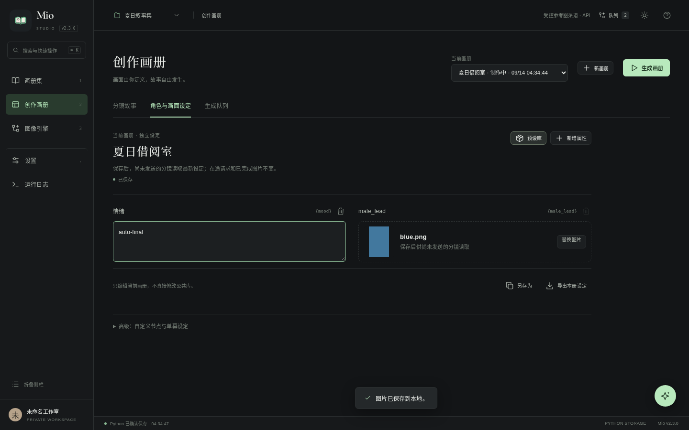
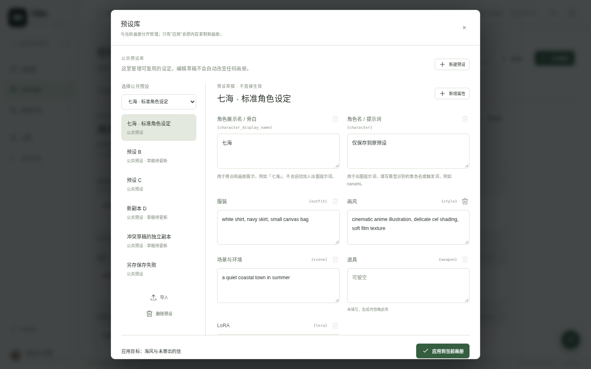

# Mio 2.3.0 验收记录

2026-09-14。完整回归已通过；不是仅凭截图或新增单元测试判定完成。

## 实际结果

| 验证 | 结果 |
| --- | --- |
| `npm test` | 成功退出；JS / HTML 检查通过，56 个 JS 契约检查通过 |
| Python | 326 个测试，322 通过、4 个 Windows 专项跳过 |
| 浏览器完整回归 | 24 个套件、747 个检查通过（Linux Chromium） |
| 本册变量 / 图片真实发送链路 | 19 个检查通过，使用浏览器 → 原生文件 → Python → 受控 HTTP Chat 图像服务 |
| 自适应阅读 | 26 个检查通过，包括真正解码的原图、离线 HTML、沙盒预览和多视口 |
| 公共预设 | 隔离 40 个、删除 23 个检查通过；无关画册原生文件字节不变 |
| 2.2.3 实际交付包升级 | 11 个检查通过，先运行原版复现三个问题，再使用新版读取同一个数据目录 |
| 解压运行包 | 15 个检查通过：ZIP CRC / 每个文件 SHA-256 / 59 份内容、启动、图片、分享导入及删除不复活 |

完整日志：[TEST_RESULTS.txt](../TEST_RESULTS.txt)。定向日志：[升级](upgrade.txt)、[实时设定](live-settings.txt)、[阅读](reading-stage.txt)、[解压运行](packaged-runtime.txt)。

历史 2.1 专项可选升级分支因未提供其旧 ZIP 而跳过；本次另以实际交付的 **2.2.3** 包完成升级验证。基线 SHA-256：

```text
f00d0d161ad5b5b11a87e7ad37e369ce9d27464cb0d030b6ca0471f8af0dfa36
```

## 不只改断言：复现与回归边界

- 原版确实出现超高竖图、主区编辑公共预设而全局仍显示画册、入队变量固定三个问题。
- 新版启动后，编辑前所有原生实体与设定文件逐字节相同；未应用的公共预设草稿仍在。旧暂停任务保留 ID 和零次发送记录，修改本册后获得新的未发送输入，不重建任务。
- 第一请求已发送旧图时，在网页换图与改变量。保存后的后续请求用新图，单幕覆盖独立；关闭网页与重启服务不重发已完成请求。409 不假装保存成功，普通防抖自动保存也能更新输入。
- 模拟慢图片准备，发送前发生修改时重新准备，旧准备不算请求或失败。503 后重试读取最新保存输入；手工 API 文字修订与图片槽位冲突明确拒绝。
- 延迟上传在切换分镜后仍归属于原画册、原分镜；两个分镜使用相同属性 ID 也不会串图。
- 旧等宽几何检查保留在明确的「连续」模式；默认模式另验证完整画面、双页、无下一页边缘、小图不放大。导出必须真正嵌入、解码五张原图，不接受占位框或只比较宽高属性。
- 1280×720、1366×768、1440×900、1920×1080 桌面与 390×844 手机尺寸已检查；精确 2:3、3:4 竖图按视口完整显示。明暗主题、下一跨页、旋转、原节点保持和自定义 24 幕翻页均有回归。
- 一并修正自适应运行时误干扰自定义翻页模板、页码、浅色主题工具栏对比度、导出偏好与预览同步、脚本字符串转义，以及按真实逐幕状态锁定工作流修改。

## 视觉记录

### 原版与新版

[原版 2.2.3 超高竖图](baseline-2.2.3-portrait.png)


### 本册与公共库





[手机本册设定](live-settings-mobile.png) · [手机预设库](preset-editor-390-dark.png) · [1366×768 精确比例](reading-1366x768-ratios.png)

### 无缝与离线


[手机无缝连续阅读](seamless-mobile.png) · [手机原生阅读](reading-mobile-continuous.png)

## 范围限制

受控服务不收费；没有调用真实收费模型做图像质量、身份保持或性能基准。原图示例不是本版新模型能力的证明。未认证物理手机、Safari / Firefox、原生 Windows / macOS 的完整运行；Windows 启动器格式有自动检查，但平台专项仍明确跳过。少量 SQLite 连接销毁警告保留在原始日志，不隐藏为不存在。
