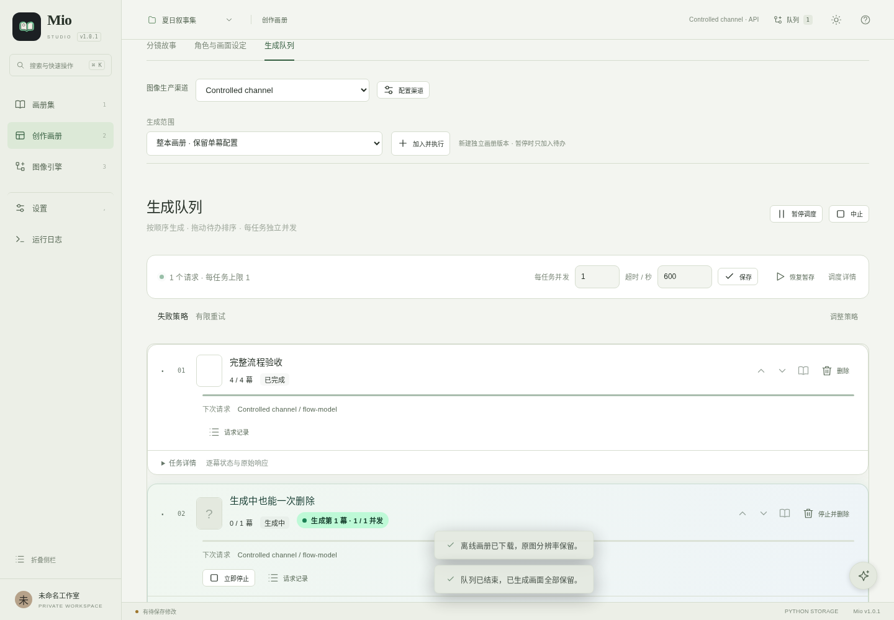
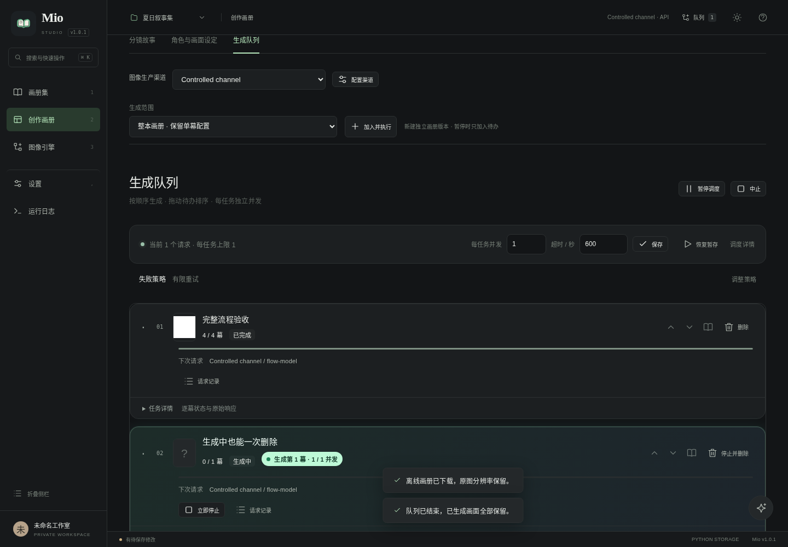
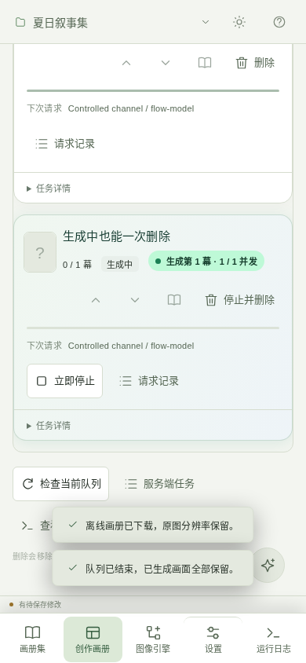
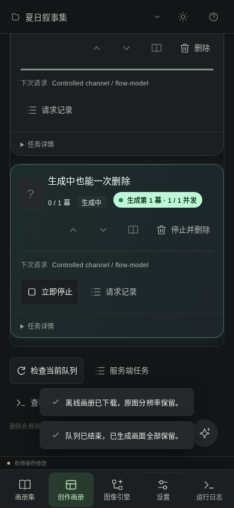
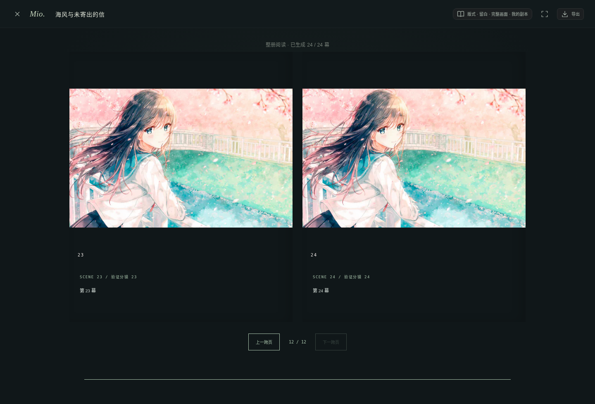
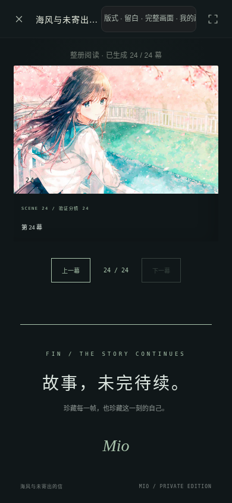

# 1.0.1 验收记录

以下是本轮真实执行的输出，不是测试计划。所有上游均为受控模拟，没有使用付费密钥。

- [全量回归输出](npm-test.txt)：`npm test` 退出码 0；包含新端到端流程。Windows 原生四项明确跳过。
- [原版删除缺陷复现](baseline-delete-repro.txt)：未修改的 `0b63298`，开始请求后停止，再删除触发 Conflict。
- [原版 Python 基线](baseline-python.txt)：原有文档生成结果过期，后续重新生成。
- [构建](build.txt) 与 [静态检查](lint.txt)。
- [真实 ZIP 解压启动与旧数据迁移](package-smoke.txt)。
- [通过验收的运行源码校验值](tested-sources.sha256)。

## 关键页面实际截图

### 桌面 · 明暗主题

### 移动视口 · 明暗主题

### 阅读器

## 方法与边界

新流程通过浏览器操作、真实 Python 服务、受控 HTTP 422/503/断线/慢响应，并在原画册修改后继续。下载得到的 HTML 实际以 file:// 重新打开；原图在浏览器解码为 2048×3072，不仅检查文件名或预览。删除回归同时检查服务端结果、请求次数、浏览器列表、旧标签页回写和重启后的状态。

早期全量执行发现旧图片变量测试依赖已关闭的“真实任务交给浏览器演示队列”入口。该测试改为真实持久队列与受控 HTTP 上游，继续检查实际图片输入顺序和完整错误，而非绕过新保护。重启测试也改为等待 HTTP 真正就绪，避免启动提示早于端口监听造成的测试竞态。

没有真实供应商扣费验证，也没有 Windows 原生、Safari、Firefox 或手机真机验证。截图是 Chromium 桌面和移动视口。运行结果不能解释为所有设备、所有供应商或任意大小画册均已验证。
