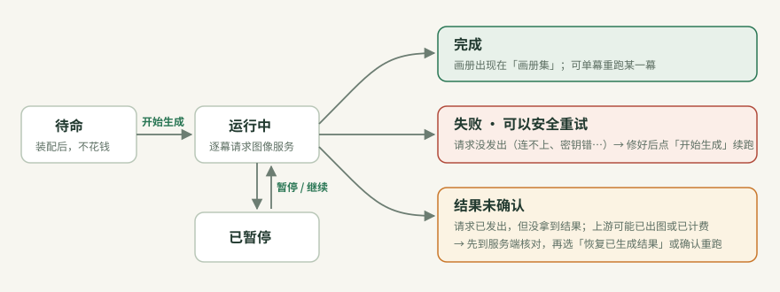

# 生成任务

**生成任务** 是装配好、等待生成的一本画册。它记下了要用的分镜、预设、图像服务和工作流（装配时的快照）。点 **「开始生成」** 后，Mio 的后端逐幕请求图像服务。关掉浏览器页面，生成也会继续。

所有生成任务都在 **创作工坊 → 装配与队列**。

## 装配

在分镜工坊点 **「去装配此分镜」**，或在「装配与队列」点 **「新建生成任务」**。有两种方式：

- **向导**：分三步，“分镜与图像服务 → 预设 → 命名与入队”。适合一次装一本。每一步底部列出本步的问题，⛔ 阻断时“下一步”不可用，每个问题都有修复按钮。
- **画布**：用连线把多份分镜和预设连起来，一次批量装配多本。

装配 **不会** 请求图像服务，也不产生费用。新任务处于 **待命** 状态。

## 状态

| 状态 | 含义 | 你可以做什么 |
|---|---|---|
| **待命** | 装配好了，还没开始 | 「开始生成」；或点「按顺序开始生成」让多本排队 |
| **排队中** | 在顺次队列里等前面的任务 | 「移出队列」 |
| **运行中** | 正在逐幕请求图像服务 | 「暂停」：已发出的分幕会返回，之后不再派发新分幕；「停止」：停止后续分幕，已生成的图片保留 |
| **已暂停** | 暂停中 | 「继续生成」 |
| **完成** | 所有分幕都有图了 | 到「画册集」阅读；不满意的幕点「单幕重跑」 |
| **异常 · 失败** | 有分幕失败，其余分幕已停下 | 按任务卡上的说明修复，再点「开始生成」续跑 |
| **结果未确认** | 请求已发出，但没拿到结果 | 先到服务端核对，见下文 |

## 运行中的操作

| 操作 | 作用 |
|---|---|
| **开始生成** | 运行这本画册。开始前会确认费用：ComfyUI 只占用显卡，云端服务可能计费 |
| **按顺序开始生成** | 把所有待命任务排成一队，一本接一本生成 |
| **全局暂停 / 继续生成 / 停止全部** | 控制整个队列 |
| **单幕生成 / 单幕重跑** | 只生成某一幕。从没生成过的幕显示“单幕生成”，已有结果的显示“单幕重跑” |
| **从此幕往后生成 / 重跑** | 从这一幕生成到最后一幕 |
| **并发** | 一本画册同时生成几幕。留空跟随全局默认；运行中修改，下一幕开始生效 |

重跑成功后替换旧图；重跑失败时 **保留原图**。点分幕缩略图可以直接看大图，不用打开画册。

## 失败了怎么办

任务卡会显示：

- **哪一类问题**，例如“连接被拒绝”；
- **错误码**，例如 `MIO-CONN-001`，旁边有「查看排错 ↗」；
- **一句原因**；
- **修复按钮**：「测试连接」「图像服务设置」「打开工作流」「查看分幕」等；
- **「技术详情」**：原始错误和请求记录，可「复制全部」。

请求 **没发出去** 的失败（连不上、找不到服务器、证书错误）可以放心重试，不会重复计费。修好后点「开始生成」，Mio 会接着生成未完成的分幕。

每个错误码的处理方法见 [常见问题与错误码](TROUBLESHOOTING.md)。

## 结果未确认

只有请求 **已经发出**、但 Mio 没拿到结果时，分幕才会标为“结果未确认”，例如生成途中关掉了 Mio，或网络在返回时断开。这时上游可能已经出图，也可能已经计费，所以 Mio **不会自动重发**。

处理步骤：

1. **到服务端核对**：ComfyUI 看历史记录，云服务看用量或历史页面。
2. **图已经生成、只是没存进 Mio**：展开分幕，点 **「恢复已生成结果」**。它只重试本地保存，不会再请求模型。
3. **确认上游没有生成**：点重跑，在“存在未确认的结果”确认框里确认。

## 删除任务

「移除任务记录」只删除任务卡；同时删除对应画册时，画册会先进 **回收站**，可以恢复。见 [备份与恢复](BACKUP.md)。

[快速开始](QUICKSTART.md) · [图像服务与密钥](CHANNELS_AND_KEYS.md) · [常见问题与错误码](TROUBLESHOOTING.md) · [术语表](GLOSSARY.md)
