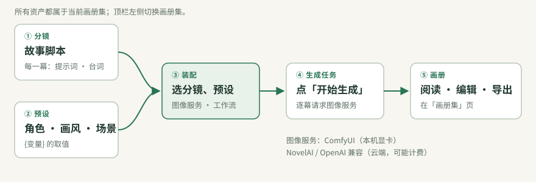

# 术语表

Mio 界面和教程里用的词，都以这张表为准。按创作流程排序。

## 内容

| 术语 | 一句话解释 | 在哪里 |
|---|---|---|
| **画册集** | 一组相关的画册、分镜和预设，相当于一个项目。 | 顶栏左侧切换；侧栏「画册集」（Alt 1）列出其中的画册 |
| **画册** | 生成好的一本漫画，可以阅读、编辑、导出和分享。 | 「画册集」页，点封面打开阅读器 |
| **分镜** | 一本画册的脚本，由若干分幕组成。 | 创作工坊 → 分镜工坊 |
| **分幕** | 分镜里的一格画面，写正向 / 负向提示词、台词和画面参数。 | 分镜工坊左侧的分幕列表 |
| **提示词** | 描述画面的文字，发给图像服务。分正向（想要的）和负向（不想要的）。 | 分幕编辑器 |
| **台词** | 这一幕的对白或旁白，显示在画册的气泡或文字区。 | 分幕编辑器 |
| **预设** | 一组变量的取值，例如角色外貌、服装、画风或场景。 | 创作工坊 → 预设工坊 |
| **变量** | 预设里的一条“名字 = 值”。在提示词或台词里写 `{名字}`，生成时换成预设里的值。 | 预设编辑器；分幕里的 `{…}` |
| **图片变量** | 值是一张图片的变量，常用作角色参考图。 | 预设编辑器，变量类型选“图片” |
| **画面参数** | 一幕的宽高、采样步数、CFG 和种子。只在开启「画面参数覆盖」的幕里生效，种子除外。 | 分幕编辑器 |
| **采样步数** | 图像模型去噪的步数（steps）。注意不要和“分幕数”混淆。 | 画面参数 |
| **种子** | 决定随机起点的数字。种子相同、其他设置相同，画面也相同。 | 画面参数；装配时的「可复现种子」 |

## 生成

| 术语 | 一句话解释 | 在哪里 |
|---|---|---|
| **装配** | 选定分镜、预设、图像服务和工作流，组合成生成任务。不会请求图像服务。 | 分镜工坊「去装配此分镜」；装配与队列「新建生成任务」 |
| **生成任务** | 装配好、等待生成的一本画册。点「开始生成」后逐幕请求图像服务。 | 创作工坊 → 装配与队列 |
| **快照** | 装配时保存下来的分镜、预设和工作流副本。之后再改原件，不影响已装配的任务。 | 生成任务内部 |
| **一帧试跑** | 用当前分镜的第 1 幕生成一张图，验证工作流和映射是否正确。 | 工作流与 API 配置 →「试跑」 |
| **单幕重跑** | 只重新生成某一幕，不动其他幕。 | 任务卡展开后的分幕列表 |
| **结果未确认** | 请求已经发出，但没有拿到结果。上游可能已出图或已计费，Mio 不会自动重发。 | 分幕状态；见 [常见问题](TROUBLESHOOTING.md#mio-res-001-结果未确认) |
| **开箱检查** | 逐项核对图像服务、工作流、模型、分镜与预设、试跑是否就绪，并给出修复按钮。 | 首页；顶栏「?」帮助 |

## 图像服务与工作流

| 术语 | 一句话解释 | 在哪里 |
|---|---|---|
| **图像服务** | 实际出图的服务：ComfyUI、NovelAI 或 OpenAI 兼容接口。 | 工作流与 API 配置（Alt 3）；顶栏右侧显示当前服务 |
| **工作流** | ComfyUI 的节点图（API 格式 JSON），决定用什么模型、怎么出图。 | 工作流与 API 配置 → 工作流库 |
| **参数映射** | 指定提示词、种子等值写进工作流里哪个节点的哪个输入。 | 工作流详情 |
| **输出节点** | 结果图片从这个节点取回，通常是 `SaveImage`。 | 工作流详情 →「结果图片回传节点」 |
| **映射预设** | 存下来的一组参数映射，可以套用到同类工作流上。 | 工作流详情 |
| **映射包** | 工作流和它的映射打成的一个文件，导入后直接可用。 | 工作流库「添加工作流」 |
| **占位名** | 随包工作流里的 `your-…` 模型名，必须换成你装好的模型。 | 工作流页标红；装配向导「模型与 LoRA」 |

## 管理

| 术语 | 一句话解释 | 在哪里 |
|---|---|---|
| **自动保存** | 编辑分镜和预设时自动写入磁盘，不需要保存按钮。 | 编辑器标题旁的“已自动保存 · 刚刚” |
| **回收站** | 删除的画册、分镜、预设、画册集和工作流会先放进这里，可以恢复或永久删除。 | 设置 → 数据与备份 → 回收站 |
| **完整备份** | 整个工作区打成一个 ZIP，不含密钥。 | 设置 → 数据与备份 |
| **资源包（.mio.zip）** | 一份或几份分镜、预设、工作流及其参考图，用于分享。 | 各工坊的「导出」「导入」 |
| **数据目录** | 存放所有创作数据的文件夹，默认是程序目录下的 `data/`，可用 `MIO_DATA_DIR` 修改。 | 设置 → 数据与备份 |

## 旧叫法对照

早期版本、旧教程或旧数据文件里可能出现下面的叫法，它们与左栏是同一个东西。

| 现在的叫法 | 旧叫法 / 数据字段 |
|---|---|
| 画册集 | 企划、独立企划、collections、`projectId` |
| 分镜 | 分镜模板、template、storyboards、`templateId` |
| 分幕 | 幕、frames、steps（作为幕数时） |
| 预设 | 视觉预设、设定预设、角色参考、rows、characters |
| 变量 | 属性、视觉属性、entries |
| 图像服务 | 渠道、图像渠道、生成服务、provider |
| 工作流 | 蓝图、管线 |
| 参数映射 | 槽位、槽位预设、bindings |
| 生成任务 | 任务卡、生产任务、队列项 |

[快速开始](QUICKSTART.md) · [变量与预设](IMAGE_VARIABLES.md) · [常见问题](TROUBLESHOOTING.md)
