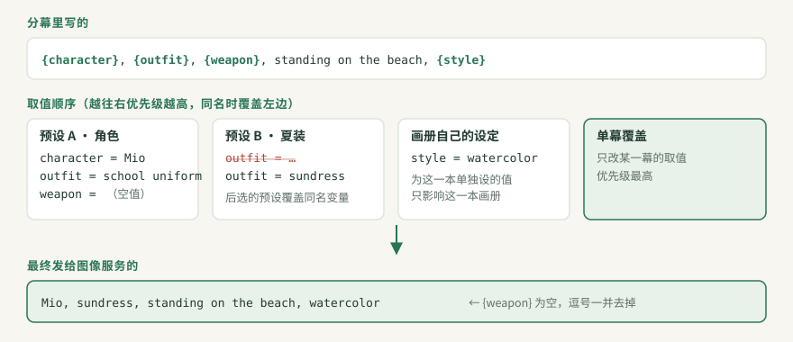

# 变量与预设

写分镜时，不用在每一幕里重复“银发、绿眼睛、白色连衣裙……”。把这些写成 **变量**，比如 `{character}`；把变量的取值放进 **预设**。装配时选好预设，生成时 Mio 会把每个 `{变量}` 换成预设里的值。

这样做的好处：

- **换角色或画风**：换一个预设就行，分镜不用动。
- **改一处，处处生效**：同一个角色出现在 12 幕里，只需要改一次。
- **图片也能当变量**：角色参考图可以作为变量发给支持图片输入的服务。

## 三个概念的关系

| 概念 | 是什么 | 在哪里 |
|---|---|---|
| **预设** | 一组变量取值，比如“角色 · 美绪”“画风 · 水彩” | 创作工坊 → 预设工坊 |
| **变量** | 预设里的一条“名字 = 值”，比如 `character = 1girl, silver hair` | 预设编辑器里的每一行 |
| **引用** | 在分幕的提示词或台词里写 `{character}` | 分镜工坊 |

预设编辑器里可以把变量放进 **分组**（例如“外貌”“服装”），分组只影响显示，不影响取值。

## 在分镜里引用变量

在提示词或台词里写 `{变量名}`：

```text
{character}, {outfit}, walking along the shore, {style}
```

- **变量名** 可以用中文、英文字母、数字和下划线，例如 `{角色名}`、`{outfit_2}`。
- **补全**：输入 `{` 会弹出当前画册集里已有的变量名。
- **即时检查**：提示词下方会显示“识别到 3 个变量 · 1 个未定义 · 1 个值为空”，写错名字马上就能发现。
- **写字面的花括号**：只有 **当前画册集里某个预设定义过** 的名字才会被当成变量。`{{masterpiece}}` 这样的双花括号、`\{x}`，以及从没定义过的名字，都按原文保留。NovelAI 的权重语法因此不受影响。

## 同名变量怎么取值



装配时可以同时选多个预设，常见搭配是“角色 + 服装 + 画风”。多个预设里有同名变量时，按下面的顺序取值，**后面的覆盖前面的**：

1. **预设**，按选择顺序。后选的预设覆盖先选的。
2. **画册自己的设定**：只为这一本画册单独设的值。
3. **单幕覆盖**：只对某一幕生效的值，优先级最高。

> 例：先选“角色 · 美绪”（`outfit = school uniform`），再选“夏装”（`outfit = sundress`），最后生成的是 `sundress`。想让校服生效，就调换两个预设的顺序，或者从“夏装”里去掉 `outfit`。

## 空值和未定义

| 情况 | 提示词里 | 台词里 |
|---|---|---|
| **值为空**：变量有定义，但值是空的 | 替换为空，**连同多余的逗号一起去掉**（引号和括号里的内容不动） | 替换为空 |
| **未定义**：画册集里有这个变量，但所选预设都没定义它 | 替换为空。装配向导标 **⚠️ 提示**：“生成时替换为空” | **⛔ 阻断**：必须先处理，否则整句台词会缺字 |
| **从未定义**：整个画册集里都没有这个名字 | 按原文保留，例如 `{mystery}` 原样发送 | 按原文保留 |

例如，`weapon` 的值为空时：

```text
写的：    {character}, {weapon}, standing on the beach
发送的：  1girl, silver hair, standing on the beach
```

装配向导第 2 步会列出所有未定义的变量，每项都有修复按钮：

- **选择包含它的预设**；
- **去第 N 幕修改**：离开向导，定位到那一幕，回来时恢复刚才的选择。

## 图片变量

预设里的变量除了文字，也可以是一张图片，常用来放角色参考图。

1. 在预设编辑器里新增变量，类型选 **图片**，上传 PNG、JPEG 或 WebP，再起个变量名，例如 `ref_mio`。
2. 在提示词里像普通变量一样引用：`{ref_mio}, smiling`。
3. 生成时，图片按在提示词里出现的顺序编号为 `@image_1`、`@image_2`……分镜工坊会显示“按提示词顺序发送的图片”预览。

不同图像服务的处理方式：

| 图像服务 | 需要做什么 |
|---|---|
| **ComfyUI** | 在「工作流与 API 配置」里，把工作流的 `LoadImage` 等图片输入节点映射到这个图片变量。没有映射时 Mio 会提示“纯文生图”，并忽略参考图，文字照常生成。见 [ComfyUI 工作流](WORKFLOW.md#图片输入) |
| **OpenAI 兼容** | 选择支持图片输入的接口协议和模型 |
| **NovelAI** | 按所选模型配置参考图用途 |

图片变量可以替换、复制或移除。导出预设时，参考图会一起打进 `.mio.zip` 资源包。

## 预设属于哪个画册集

目前分镜和预设都属于 **当前画册集**。切换到另一个画册集后，预设工坊里只显示那个画册集的预设。要在别的画册集里使用某个预设，可以先在预设工坊 **导出** 它，再到目标画册集 **导入**。

## 小技巧

- **一个预设只管一件事**（角色 / 服装 / 画风 / 场景），组合起来最灵活。
- **变量名要一眼看懂**：`character_display_name` 比 `n1` 好维护。
- **示例里不要留空变量**：没有用处的 `{weapon}` 只会让提示词难读。
- **先试一两幕**：新预设先装配一个一两幕的生成任务试跑，确认取值符合预期再生成整本。

[快速开始](QUICKSTART.md) · [ComfyUI 工作流](WORKFLOW.md) · [内容与分享](CONTENT_AND_SHARING.md) · [术语表](GLOSSARY.md)
