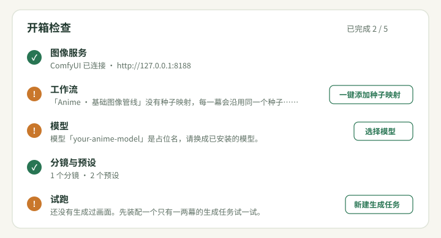

# 快速开始

这一篇带你从打开 Mio 到读完第一本画册。有两条路线：

| 路线 | 需要什么 | 用时 | 适合 |
|---|---|---|---|
| **A · 离线练习** | 什么都不用配 | 约 30 秒 | 先看看 Mio 是怎么工作的 |
| **B · 真实出图** | ComfyUI，或 NovelAI / OpenAI 兼容服务的 API Key | 约 5 分钟 | 做自己的第一本画册 |

建议先走 A，再走 B。碰到陌生的词可以查 [术语表](GLOSSARY.md)。


## 0. 启动 Mio

需要 Python 3.10 或更新版本。在项目根目录运行：

```bash
python -m pip install -r packaging/requirements.txt
python server.py
```

浏览器打开 **http://127.0.0.1:8777**。Windows 可以双击 `start.bat`，Linux / macOS 运行 `sh start.sh`。

**预期结果**：看到首页“让故事成帧，让灵感成册。”，下方有「开箱检查」卡片。

**如果打不开**：看终端里有没有报错；端口 8777 被占用时，先关掉占用它的程序。更多情况见 [常见问题](TROUBLESHOOTING.md#启动与保存)。

## 路线 A · 离线练习（30 秒）

离线练习用本地示意图代替真实出图，不连接任何图像服务，也不产生费用。

1. 在首页点 **「先用离线练习体验」**。
2. Mio 会新建一个画册集「快速开始 · 三幕练习」，里面有一个三幕分镜、一个角色预设，并立即生成一本三幕画册。
3. 生成完会提示“三幕练习已生成，可以阅读、审校或导出。”首页按钮变成 **「打开离线练习画册」**，点它进入阅读器。

**预期结果**：阅读器里能翻三页，每页有示意图和台词。

在阅读器里可以试试这些操作（详见 [阅读与导出](PRESENTATION.md)）：

- 用 ← / → 翻页；
- 切换展示模板；
- 编辑气泡和文字；
- 导出 HTML、图片 ZIP 或 PDF。

> 练习画册只用来熟悉流程。练完后可以在顶栏左侧切回你自己的画册集；不需要时，删除「快速开始 · 三幕练习」这个画册集即可。

## 路线 B · 用真实图像服务出图（5 分钟）

首页的「开箱检查」会逐项核对下面几步，未完成的项旁边有修复按钮。顶栏的「?」帮助里也有同一份清单。



### 第 1 步 · 选图像服务

打开侧栏 **「工作流与 API 配置」**（快捷键 Alt 3），选择你要用的图像服务：

| 图像服务 | 要填什么 | 费用 |
|---|---|---|
| **ComfyUI** | 地址，默认 `http://127.0.0.1:8188` | 用自己的显卡，不产生费用 |
| **NovelAI** | API Key（模型和地址已有默认值） | 按 NovelAI 账户扣点数 |
| **OpenAI 兼容** | 基础地址（到 `/v1`）、模型 ID、API Key | 按服务商计费 |

每种服务怎么填，见 [图像服务与密钥](CHANNELS_AND_KEYS.md)。

**预期结果**：顶栏右侧显示当前服务和状态，例如“ComfyUI · 已连接”或“NovelAI · 就绪”。

**如果显示“未连接”或“待配置”**：点它，会直接打开图像服务设置，并告诉你第一项缺什么。

### 第 2 步 · 只用 ComfyUI 时：工作流和模型

使用 NovelAI 或 OpenAI 兼容服务可以跳过这一步。

1. Mio 自带一份「Anime · 基础图像管线」工作流。也可以导入你自己的工作流，步骤见 [ComfyUI 工作流](WORKFLOW.md)。
2. 开箱检查如果提示 **“没有种子映射”**，点 **「一键添加种子映射」**。不加的话，每一幕会用同一个种子，12 幕画面几乎一样。
3. 随包工作流里的模型名 `your-anime-model` 只是占位名。点 **「同步模型列表」**，再点 **「选择模型」**，换成你在 ComfyUI 里装好的 Checkpoint。

**预期结果**：开箱检查里“工作流”和“模型”两项都打勾。

### 第 3 步 · 写分镜

1. 侧栏 **「创作工坊」**（Alt 2）→ **分镜工坊** → **「新建分镜」**。
2. 在第一幕的「正向提示词」里写画面，例如：

   ```text
   {character}, {outfit}, standing on the beach, sunset, {style}
   ```

   花括号里的是 **变量**，生成时会换成预设里的值。
3. 在「台词」里写这一幕的对白。
4. 点「新增分幕」再写一两幕。第一次试跑建议 **只写 1–2 幕**，出问题时浪费最少。

修改会自动保存，标题旁显示“已自动保存 · 刚刚”，不需要找保存按钮。

### 第 4 步 · 建预设

1. **创作工坊 → 预设工坊 → 「新建预设」**。
2. 为分镜里用到的每个变量填一个值，例如：

   | 变量 | 值 |
   |---|---|
   | `character` | `1girl, silver hair, green eyes` |
   | `outfit` | `white sundress` |
   | `style` | `anime, soft lighting` |

一个预设不需要装下所有变量。常见做法是“角色”“服装”“画风”各建一个，装配时一起选。多个预设的同名变量怎么取值，见 [变量与预设](IMAGE_VARIABLES.md)。

**预期结果**：开箱检查里“分镜与预设”打勾。如果提示某些变量“还没有预设定义”，说明还有变量没填。

### 第 5 步 · 装配成生成任务

在分镜工坊点 **「去装配此分镜」**，或在「装配与队列」里点 **「新建生成任务」**。向导有三步：

1. **分镜与图像服务**：确认分镜、图像服务和工作流。
2. **预设**：单击选择预设（Ctrl / ⌘ 点击可加选）。如果只有一个预设能覆盖分镜的全部变量，Mio 会自动选中它。
3. **命名与入队**：画册名默认是“分镜名 · 角色名”，可以改。

每一步底部会列出这一步的问题：

- **⛔ 阻断**：必须先处理，这时“下一步”是灰的；
- **⚠️ 提示**：可以继续，但建议看一眼。

每个问题旁边都有修复按钮，例如“去第 2 幕修改”。

**预期结果**：「装配与队列」里多了一张 **待命** 的任务卡。装配不会请求图像服务，也不花钱。

### 第 6 步 · 开始生成

1. 在任务卡上点 **「开始生成」**。
2. 确认框会说明费用：ComfyUI 只占用显卡，云端服务可能计费。确认后开始。
3. 展开任务卡可以看每一幕的进度和缩略图；点缩略图看大图。

**预期结果**：任务状态变成“完成”，画册出现在侧栏 **「画册集」**（Alt 1）里。

**如果失败**：任务卡会写明原因，例如“连接被拒绝”，并给出「测试连接」「图像服务设置」等按钮。原始报错在「技术详情」里。对照 [常见问题](TROUBLESHOOTING.md) 处理后，再点「开始生成」，会接着生成没完成的分幕。

### 第 7 步 · 阅读与导出

在「画册集」页点封面打开阅读器。阅读、编辑和导出的操作与路线 A 相同，见 [阅读与导出](PRESENTATION.md)。

## 下一步

- 画面不满意？在任务卡上对某一幕点 **「单幕重跑」**，不用整本重来。
- 想把角色和画风固定下来？细化预设，参见 [变量与预设](IMAGE_VARIABLES.md)。
- 想用自己的 ComfyUI 工作流？参见 [ComfyUI 工作流](WORKFLOW.md)。
- 做好的内容记得备份，参见 [备份与恢复](BACKUP.md)。

[术语表](GLOSSARY.md) · [图像服务与密钥](CHANNELS_AND_KEYS.md) · [常见问题](TROUBLESHOOTING.md)
