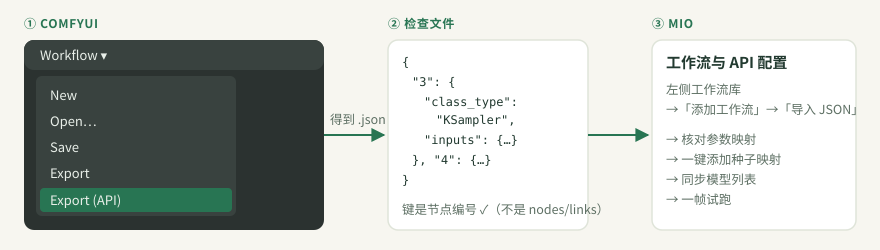
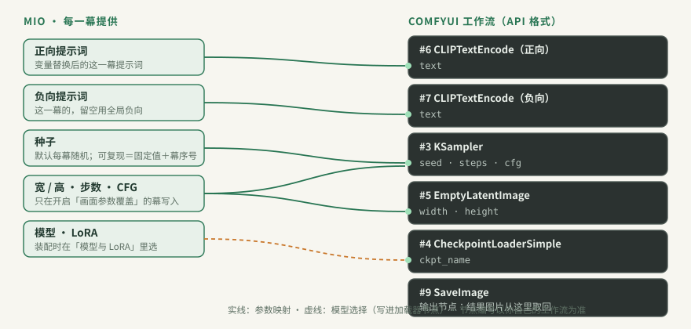

# ComfyUI 工作流

使用 ComfyUI 时，Mio 不关心你用什么模型、什么节点。它只做一件事：把每一幕的提示词、种子等值，写进你工作流里指定节点的指定输入，这就是 **参数映射**；然后提交给 ComfyUI，从输出节点取回图片。

本篇按顺序讲：导出 → 导入 → 映射 → 模型与 LoRA → 一帧试跑。使用 NovelAI 或 OpenAI 兼容服务时不需要工作流，可以跳过本篇。

## 1. 从 ComfyUI 导出 API 格式

1. 在 ComfyUI 里打开一份 **能正常出图** 的工作流，先在 ComfyUI 里跑通一次。
2. 导出 API 格式：
   - **新版界面**：菜单 **Workflow → Export (API)**。
   - **旧版界面**：先在设置里打开 **Enable Dev mode Options**，再点侧栏的 **Save (API Format)**。
3. 保存得到的 `.json` 文件。

**怎么判断导出对了**：用文本编辑器打开文件，最外层的键应该是节点编号（`"3"`、`"4"`…），每个节点带有 `class_type` 和 `inputs`。

如果看到的是 `nodes`、`links` 这样的字段，那是 **编辑器格式**（普通的 Save 保存出来的）。Mio 会拒绝导入，并提示“这是 ComfyUI 编辑器格式，请导出 API 格式后导入”。

## 2. 导入 Mio

1. 打开 **「工作流与 API 配置」**（Alt 3），在左侧工作流库点 **「添加工作流」**。
2. 点 **「导入 JSON」** 选择文件，也可以直接把文件拖进来。可以一次选多个；单个文件不超过 10 MB。
3. Mio 会自动识别正负提示词、种子和输出节点，作为初始映射。

**自动识别只是起点，一定要核对**：正向、负向有没有接反？输出节点是不是最终出图的那个？

也可以导入 **Mio 映射包**：别人导出的“工作流 + 映射”，导入后直接可用。

## 3. 参数映射

在工作流详情里，每条映射说明三件事：**写到哪里**（节点和输入字段）、**填什么**（取值来源）、**效果如何**（预览）。点 **「添加映射」** 可以从节点里挑一个输入字段。

最少需要这几条：

| 映射 | 常见的写入位置 | 不设会怎样 |
|---|---|---|
| **正向提示词** | 正向 `CLIPTextEncode` 的 `text` | 分镜里的提示词不会写进工作流，开箱检查会标出来 |
| **负向提示词** | 负向 `CLIPTextEncode` 的 `text` | 沿用工作流里原本的负向词 |
| **种子** | `KSampler` 的 `seed`（或 `noise_seed`） | **每一幕用同一个种子，整本画面几乎一样** |
| **输出节点** | `SaveImage` 或 `PreviewImage` | 生成完拿不到图片（“结果图片回传节点”） |

### 种子

没有种子映射时，开箱检查和装配向导都会提示，并提供 **「一键添加种子映射」**：自动找到采样器的 `seed` / `noise_seed` 输入并映射。找不到时会说明要手动映射。

映射好之后，种子这样工作：

- **默认**：每一幕、每次重跑都用新的随机种子；
- **装配时开启「可复现种子」**：种子 = 固定种子 + 幕序号，同样的设置会得到同样的画面。

### 宽高、步数、CFG

可以为这几项建立 **分镜画面参数** 映射。它们只在分幕开启了 **「画面参数覆盖」** 时才写入，没开启的分幕保持工作流原值。种子是例外，每一幕都会写入这一幕自己的种子。

### 图片输入

预设里的图片变量（角色参考图等）需要映射到工作流里的 `LoadImage` 等图片输入节点才会发送。没有映射时，Mio 会提示“所选工作流是纯文生图”，并忽略提示词里引用的参考图。详见 [变量与预设](IMAGE_VARIABLES.md#图片变量)。

### 映射预设

同一类工作流（比如都用 KSampler + CheckpointLoader）的映射可以存成 **映射预设**，下次导入新工作流时直接应用。应用时，普通映射追加到现有映射之后，模型与 LoRA 映射会替换对应设置。

## 4. 模型与 LoRA

工作流里写死的模型文件名，在你的 ComfyUI 里不一定存在。

1. 连上 ComfyUI 后，点右上角 **「同步模型列表」**。Mio 会读取 ComfyUI 里已安装的 Checkpoint、UNet 和 LoRA。
2. 工作流页会把找不到的模型 **标红**，并计入顶部的“待检查”。`your-…` 这样的占位名一律会被标出。
3. 在 **装配向导** 的「模型与 LoRA」面板里选一个已安装的模型。选择会按工作流记住，下次装配自动沿用。也可以用 **「编辑工作流 JSON」** 直接改文件名。

**LoRA**：

- 开启 **LoRA 映射** 后，装配时可以叠加 LoRA。LoRA 名称通常对应 `lora_name`，权重对应 `strength_model` 和 `strength_clip`。
- LoRA 堆栈节点可以填编号槽位（`lora_name_N` / `strength_N` / `switch_N`，或 rgthree 的 `lora_N`），空槽位会自动关闭。
- LoRA 映射关闭时，工作流里已有的 LoRA 原样提交。

## 5. 一帧试跑

映射核对完，点 **「试跑」**。它用当前分镜的 **第 1 幕** 生成一张图，验证映射是否正确。真实生成前需要先连接 ComfyUI。

**预期结果**：几秒到几十秒后出现“试跑结果”缩略图，画面符合第 1 幕的提示词。

**如果不对**：

| 现象 | 多半是 |
|---|---|
| 画面和提示词无关 | 正向提示词映射到了别的节点，或正负接反 |
| 报“缺少模型文件” | 模型名不对，回到第 4 步 |
| 报“工作流节点缺失或不兼容” | ComfyUI 缺自定义节点，先在 ComfyUI 里装好并跑通 |
| 试跑成功但拿不到图 | 输出节点选错了 |

更多报错见 [常见问题](TROUBLESHOOTING.md)。

## 6. 在生成任务中使用

装配向导第 1 步会选择工作流。工作流有问题时（缺种子映射、占位模型名），向导里会直接显示，并提供修复按钮。每个生成任务在装配时会给工作流拍一张快照，之后再改工作流，不会影响已经装配好的任务。

[图像服务与密钥](CHANNELS_AND_KEYS.md) · [变量与预设](IMAGE_VARIABLES.md) · [常见问题](TROUBLESHOOTING.md) · [术语表](GLOSSARY.md)
